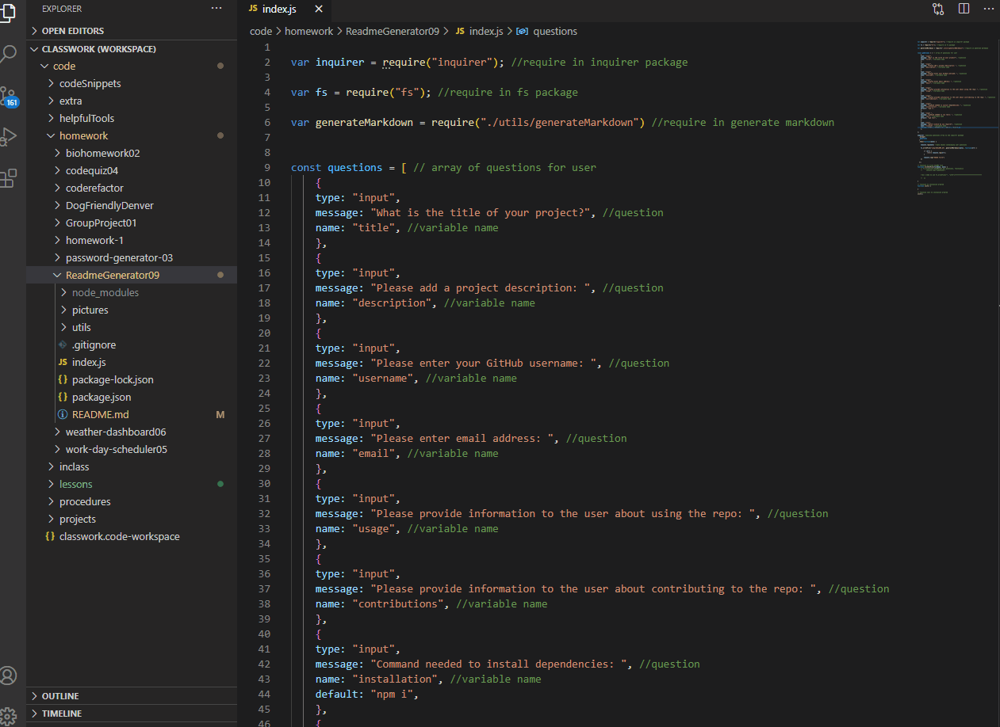
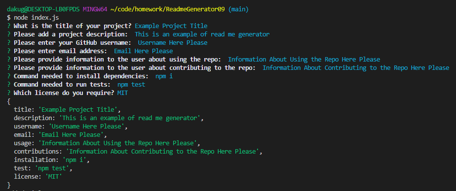
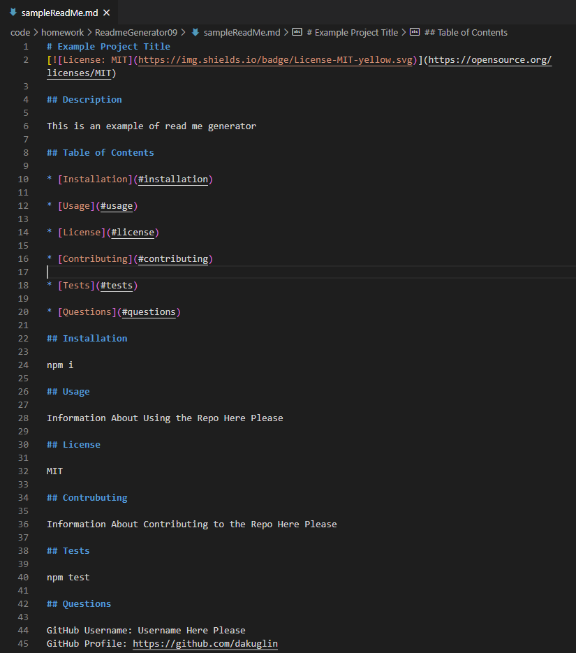

# ReadmeGenerator09

* The generated README includes 1 badge that's specific to the repository.
WHEN I choose a license for my application from a list of options
THEN a badge for that license is added hear the top of the README and a notice is added to the section of the README entitled License that explains which license the application is covered under

## Description 

The purpose of this assignemt is to have code automitically generate a README file based on user input. The user is promped with a list of quesitons/verifications and the file is created based off the answers. This code is useful becuase it ensures that no aspect of a quiality README is missed or overlooked and also helps save a bit of time in generating the basic structure of the README. 

This project requires the use of packages from npmjs.com. We are using the Inquirer.js package to display questions to the user in the terminal. The fs package is also being used to write the markdowns provided by the user to the REAMME.md file. 

## Table of Contents 

* [Video](#video)
* [Installation](#installation)
* [Usage](#usage)
* [Credits](#credits)
* [License](#license)
* [Questions](#questions)

## Video

Video of the working code in the terminal and how to utilize the code. You can see how the user inputs the prompt informaiton, and then a "sampleReadMe.md" is generated with all the provided informaiton. The name of the README file being generated is called "sampleReadMe.md". 

## Installation

Steps to install my project include:
*
*
*

## Usage 

* When the user wants to run the code first navigate to the index.js file in the terminal, and type node index.js.This will start running the code in the terminal. After this a series of questions and verifications will be presented to the user.

* After the user inputs all the information a file called "sampleReadMe.md" will generate with user information and appear in the file folder. All of the information provided by the user will be generated in the sampleReadMe.md. 

## Credits

All of the code was developed by Dana Kuglin. Information about her GitHub profile and how you can contact her are listed below in the questions section.  

## License

MIT

## Questions

GitHub Username: dakuglin
GitHub Profile: https://github.com/dakuglin

Please email me with additional questions at dakuglin@gmail.com  

    