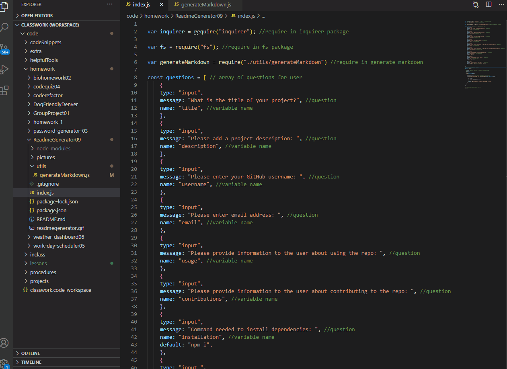

# ReadmeGenerator09

## Description 

The purpose of this assignemt is to have code automitically generate a README file based on user input. The user is promped with a list of quesitons/verifications and the file is created based off of the answers. This code is useful becuase it ensures that no aspect of a  quiality README is missed or overlooked and also helps save a bit of time in generating the basic structure of the file. 

This project requires the use of packages from npmjs.com. We are using the Inquirer.js package to display questions to the user in the terminal. The fs package is also being used to write the  

## Walk Through 

When the user wants to run the code first navigate to the file in the terminal, and type node index.js. After this a series of questions and verifications will be presented to the user.

After the user inputs all the information a file called "sampleReadMe.md" will generate with user information and appear in the file folder. 

## Table of Contents 

* [Video](#video)
* [Installation](#installation)
* [Usage](#usage)
* [Credits](#credits)
* [License](#license)
* [Questions](#questions)

## Video

Video of my working code in the terminal. You can see the generation of a README based off of user inputs. The name of the README file being generated is called "sampleReadMe.md". 

## Installation

What are the steps required to install your project? Provide a step-by-step description of how to get the development environment running.

## Usage 

Provide instructions and examples for use. Include screenshots as needed. 

## Credits

List your collaborators, if any, with links to their GitHub profiles.

If you used any third-party assets that require attribution, list the creators with links to their primary web presence in this section.

If you followed tutorials, include links to those here as well.

## License

The last section of a good README is a license. This lets other developers know what they can and cannot do with your project. If you need help choosing a license, use [https://choosealicense.com/](https://choosealicense.com/)

## Questions

GitHub Username: dakuglin
GitHub Profile: https://github.com/dakuglin

Please email me with additional questions at dakuglin@gmail.com  

    